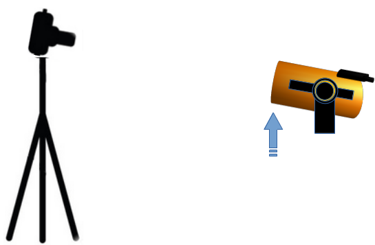
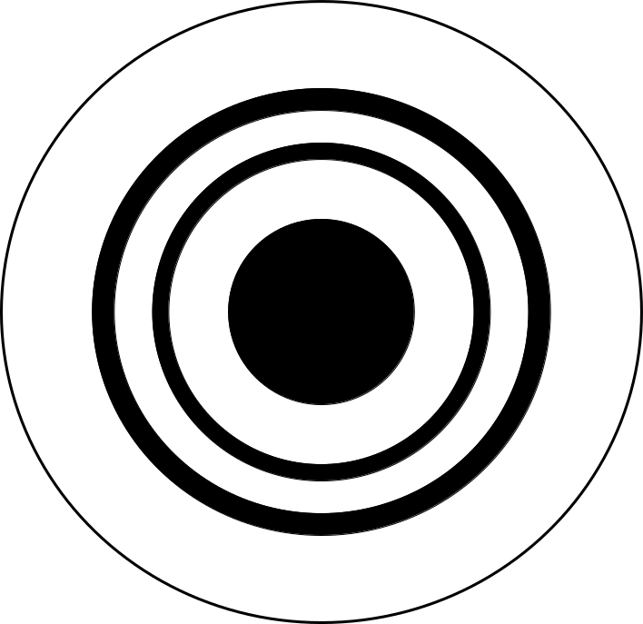
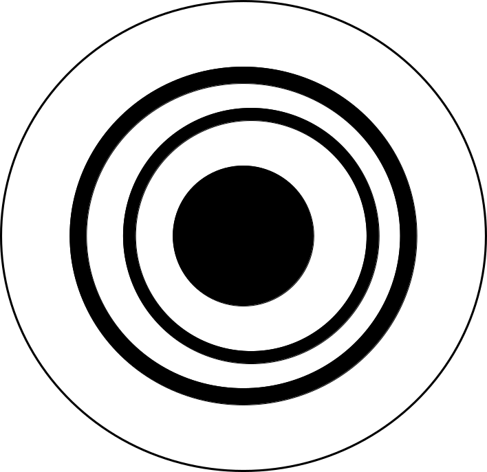
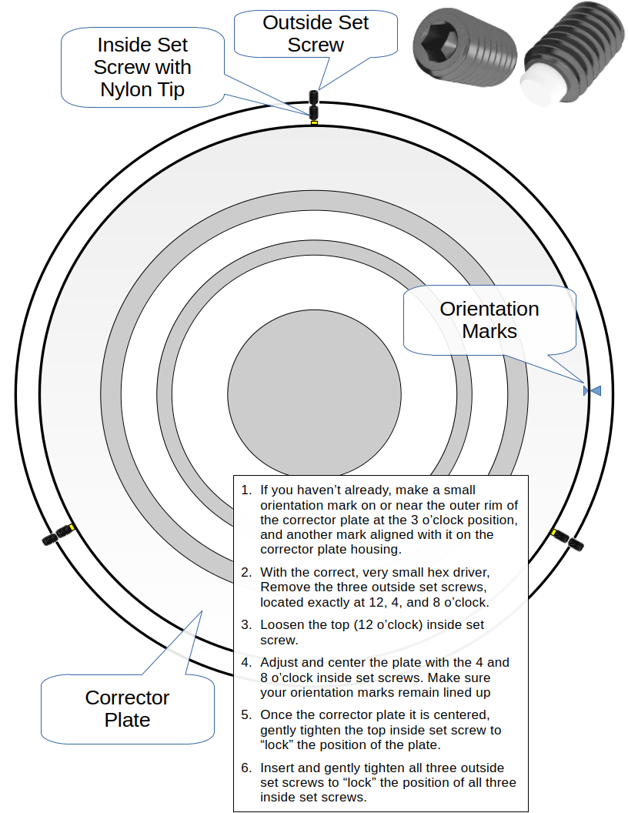
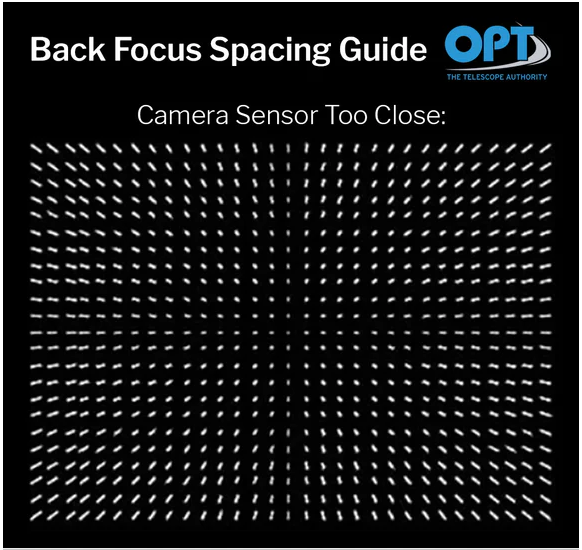
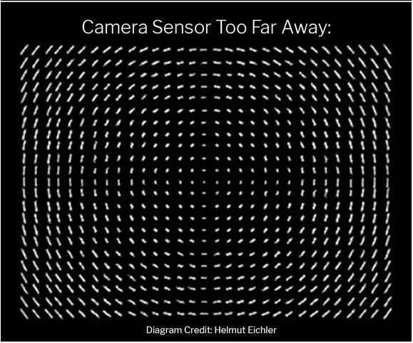
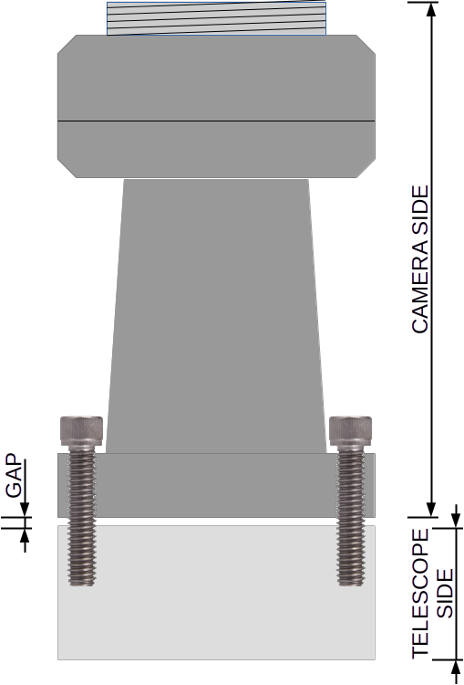
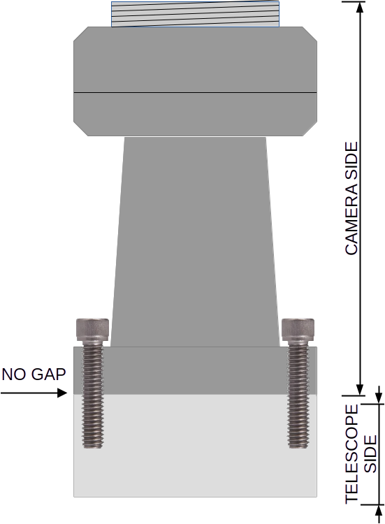
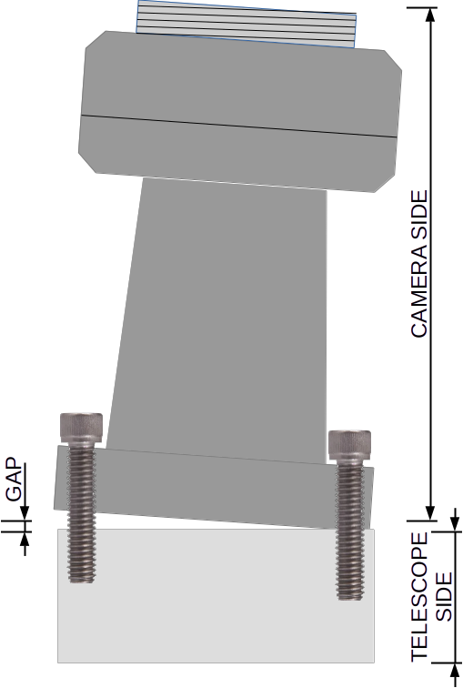
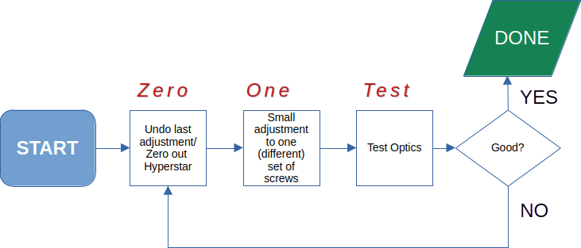

# Hyperstar-8-v4-Collimation
_Hyperstar 8 v4 Initial Set Up and Collimation: Getting a Flat Field and Sharp Stars_

Many users of Starizona’s Hyperstar system manage to configure their image trains to get wonderful images. Others don’t have the same experience. This documentation is for the folks in the latter camp, who want to get into the former camp.

We’ll try to stay out of the theoretical weeds in this document and stick to the concepts you need to know to enjoy the Hyperstar system. Although tolerances within this optical system are measured in microns, proving a recipe for frustration and hair loss, there are elegant methods to set up and collimate the Hyperstar. Anyone owning Hyperstar owes it to themselves to take a few minutes and review the basics and the workflows recommended by its manufacturer, Starizona. It looks daunting at first, but read on, and you’ll see how easy it is.

##"We Are Ready If Our Minds Be So"

### Start with a Centered Corrector Plate
> [!IMPORTANT]
> A corrector plate that is centered (optically “on-axis”) is the foundation for everything else described in this documentation. Without a centered corrector plate, you will not get a flat field or sharp stars in your images. You might even think there’s something wrong with the Hyperstar itself.

Secure the SCT on its mount and tilt it slightly upward, toward you, so that you can look straight down into the corrector. The telescope should not point horizontally or down.

Set the camera on a tripod 7 ft away, so that it points straight down into the telescope and you can see the dark, concentric rings pattern. Look at the camera’s image and focus, zoom, or whatever is necessary to see the pattern of concentric rings.

Here’s an example of a well-centered corrector plate. Note that all circles are perfectly concentric. They are evenly spaced in all directions.

Here is an example of a corrector that is not centered. Notice the uneven spacing.

Your adjustments should center the corrector plate until it appears optically “on-axis”, and all the circles are as concentric as you can get them.

_You don’t center the corrector plate relative to its enclosure_. For my corrector plate to be on-axis, it sits to one side in its enclosure.

Remove screws holding dew heater or original retaining ring. Note how “loose” these screws are. They are not tightened down. They are firm enough to hold the retaining ring in place.

Mark the edge of the corrector plate and the edge of the corrector plate enclosure (“Orientation Marks” in the following diagram) so that if the corrector plate moves one way or the other in its clockwise orientation, you can return to the precise orientation. It’s argued back and forth online about whether the clockwise positioning (aka “clocking”) of the corrector plate matters. One camp is convinced that the optics are tested and committed at the factory, and that straying from the factory orientation of the corrector will produce sub-optimal results. The other camp calls it a “corrector” and claims there is no difference. Some claim it’s relevant for older scopes and not the newer ones. I prefer to play it safe, as rediscovering the optimal orientation of the corrector plate is not a task I’m equipped to do, either financially or from a time perspective.

Use the instructions in the following image to center the corrector plate.

Replace the retainer ring and reattach the three screws. Note that these do not need to be tight, but are there to secure the ring in place.

### Check For Correct Back Focus
Back focus for a Hyperstar system is critical. This means that the camera sensor must be a precise distance from the Hyperstar lens. Even a very small error of 0.2mm too far or too close is noticeable in your images. 
The following image is an example of the star pattern caused by a sensor that is too close to the Hyperstar lens. The back focus needs to be increased.

The next image is an example of the star pattern caused by a sensor that is too far away from the Hyperstar lens. The back focus needs to be decreased. (Thank you to Helmut Eichler and OPT for the images!)

To ensure accurate back focus, Starizona outfits the Hyperstar v4 or the Hyperstar v4 + (new) Modular Filter Drawer with the correct camera adapter at the time of purchase. In other words, if you’ve screwed everything together correctly, and you [Zero Out The Hyperstar](#zero-out-the-hyperstar), the backfocus should be correct. If you’re not entirely sure if you have the right adapter for your configuration, just email Starizona for confirmation.

> [!TIP]
> [Zero Out The Hyperstar](#zero-out-the-hyperstar) before you test for back focus. You will most likely still need to finely collimate the system using the three pairs of push/pull screws.

You can buy M48 (T2) fine-adjustment spacers if you need to increase the distance. You might need to do this if the native distance needs adjustment (very unlikely) or because you’ve added a filter (which increases backfocus by 1/3 the thickness of the filter).  Aluminum is a better material than the plastics available, and getting a set that includes a 0.3mm spacer is good. Very, very small adjustments make a big difference.

### Free Yourself from the Fear of Collimation
Feeling dread? 

Take comfort in the idea that collimating Hyperstar is easier than you imagine. It is hard to mess it up beyond repair. Why? The housing of the Hyperstar unit is two optical parts held together by three pairs of push-pull screws. That’s it.

You turn the screws, increasing or decreasing the small gap between the two optical components to correct for tilt, and to perform fine collimation.

Your choice of collimation tool might include:
- Metaguide
- Bahtinov mask
- Defocussed star
- NINA’s Abberration Inspector (Hocus Focus plugin)
- Sharpcap

### Use the Zero, One, Test Workflow
Let's promote the collimation workflow that is used by Starizona.

Begin by [Zero Out The Hyperstar](#zero-out-the-hyperstar) system, so there is no gap between the camera side and the telescope side parts of the housing. 

Using the guidance and clues provided by your collimation tool (Bahtinov mask, Metaguide, etc.), make adjustments to just **ONE** pair of push/pull screws - using 1/8 turn increments with the tall push screw and the neighboring short pull screw to lock in the adjustment. Make adjustments using the _tall_ push screw. Use the short pull screw to “lock” your adjustment in place. Practice. The following image gives you a (albeit very exaggerated) view of the effect of adjusting one pair of screws has on the relationship between the two parts: you’re intentionally introducing tilt into the system.

**TEST**.  If the adjustment results in acceptable stars in the corners of your image, then you’re done!
If your adjustment didn’t move the visual markers in your collimation tool in the right direction, you undo the adjustment you just made. In other words, you return the Hyperstar system to the zeroed-out (“no gap”) configuration. Then, you try again with a different pair of screws.
Zero, one, test, repeat if necessary.

This workflow is important. Using this method, you always stay as close as possible to the proper backfocus (assuming “no gap” is the right backfocus for you). If you don’t, and you continue to make adjustments without zeroing out first, the back focus will incrementally drift, which means that your attempts to get a good collimation will produce incrementally bad results.

## Prepare for Collimation

**To prepare the SCT for collimation:**
1. Remove the dew shield.
2. Slew to zenith, as this allows gravity to help you with your adjustments.
3. Enable tracking. Alternatively, point to Polaris.
4. Focus. Make sure the stars in the center of view are in focus.
5. Center a bright start in the FOV.

<!--       Test Ed Ting’s “put stick in front of screw”:
Move the stick so to where the shadow of the secondary is nearest to edge
You should now see both the secondary's nearest position to the edge as well as the sticks shadow (will require clockwise adjustments)
Slide the stick to the nearest adjustment screw and use tiny 1/8th turns to adjust.
Turn clockwise to move the shadow away from the screw and counter clockwise to move it towards the screw. -->

## Zero Out the Hyperstar

**To zero out initial configuration, i.e., start with no gap:**
1. Tighten short pull screws. 
2. Loosen long push screws. 
3. Repeat. 
4. Rotate so you can see that the gap is consistent. Repeat 1 and 2 if needed, or until the two parts of the housing sit flush against one another with no gap between them.
5. Tighten rotator screws assembly -everything should now be tight with no play.
6. Loosely snug/tighten the long push screws.

## Adjust One Push/Pull Screw Pair

**To adjust one pair of screws:**
1. Loosen the short pull screw first (won't change positioning).
2. Tighten the tall push screw to increase the gap by a very small increment. Use tiny 1/8th turns to adjust.
3. Tighten short pull screw to lock position.
4. Recenter the bright start in the FOV after the adjustment, and test the optical performance.
5. If it didn't improve, undo the adjustment you just made, and try a different pair of screws, always recentering the bright star in the FOV after each adjustment, before testing optics again.
6. Repeat the previous two steps until the adjustment results in good performance.

## Undo the Adjustment

**To undo an adjustment to a pair of screws:**
1. Loosen short pull screw. 
2. Loosen tall push screw back to where it was. 
3. Tighten short pull screw.
4. You should now be "zeroed out" again, and ready to try a different pair of screws. 

## Save the Final Collimation

Once the desired optical performance is achieved, double-check that all of the short pull screws are snug. 
> [!IMPORTANT]
> Snugging down all of short pull screws after collimation is how the Hyperstar system “saves” the configuration. You can use native secondary and the Hyperstar interchangeably, and because of the stationary short pull screws, you shouldn’t need to recollimate the Hyperstar after using the native secondary.

## Re-Collimate the Hyperstar
If you need to collimate the Hyperstar again, begin by [Zero Out The Hyperstar](#zero-out-the-hyperstar) and then performing collimation.
   
# Resources

## Using Metaguide

https://www.cloudynights.com/topic/888670-please-help-with-hyperstar-collimation/

Forums:

https://www.smallstarspot.com/

https://www.cloudynights.com/topic/736036-new-website-for-metaguide-collimation-guiding-and-online-apps/

Metaguide settings and best demo:

https://m.youtube.com/watch?v=5NmNgtQ1SIw

https://youtu.be/QvgtnR2VyDE

## Bhatinov Mask Collimation Tool

https://github.com/insertnamehere1/Bahtinov-Collimator

<!--

## Defocus on Star

Therein lies the first problem. Lose the donut. If you are defocusing until you see the donut, you are defocusing WAY too far.

You just want to BARELY defocus until you see a small bullseye with two or three bright rings around it. Kinda looks like this: 
Defocus.jpg
Your key to initial fine collimation is that little dot in the center (the Poisson Spot). When your collimation is off, that dot will be slightly off-center.

Each time you make an adjustment, be sure to put the star in the center of your field of view. Start at 100X and center the Spot. Then go up to about 250X and center the Spot. Now walk it up to 500X or 600X. It will be a bit mushy, but in the steadier moments, you will be able to see and center the Spot. At this level of magnification, make TINY, barely perceptible movements of the collimation screws, or you will chase collimation around and around.

This "step up to 600X method" will get you pretty darn close to perfect collimation. When you get back down to real world observing around 200X-250X, things will be much better and stars will go to a point when you focus, with no flaring as the star comes to a point. As Bob mentioned, you need a night of great seeing to do a final final nailing of the collimation on an in-focus star. But if you wait for a night that steady, it could literally take months depending on your location.
Edited by Ihtegla Sar, Today, 03:59 AM.

## Ed Ting's Instructions

Here's the procedure:
1-Center a star like Polaris
2-Turn the focus knob maybe one turn or less to defocus star.
3-Move the stick so to where the shadow of the secondary is nearest to edge
4-You should now see both the secondary's nearest position to the edge as well as the sticks shadow (will require clockwise adjustments)
5-Slide the stick to the nearest adjustment screw and use tiny 1/8th turns to adjust.
6-Turn clockwise to move the shadow away from the screw and counter clockwise to move it towards the screw.
7-Recenter the star after every adjustment.

Ed's Guide 

https://astromart.com/reviews-and-articles/reviews/beginners/show/eds-guide-to-sct-collimation

-->

## Celestron Instructions

Celestron Collimation Blog

https://www.celestron.com/blogs/knowledgebase/sct-edgehd-collimation-guide

