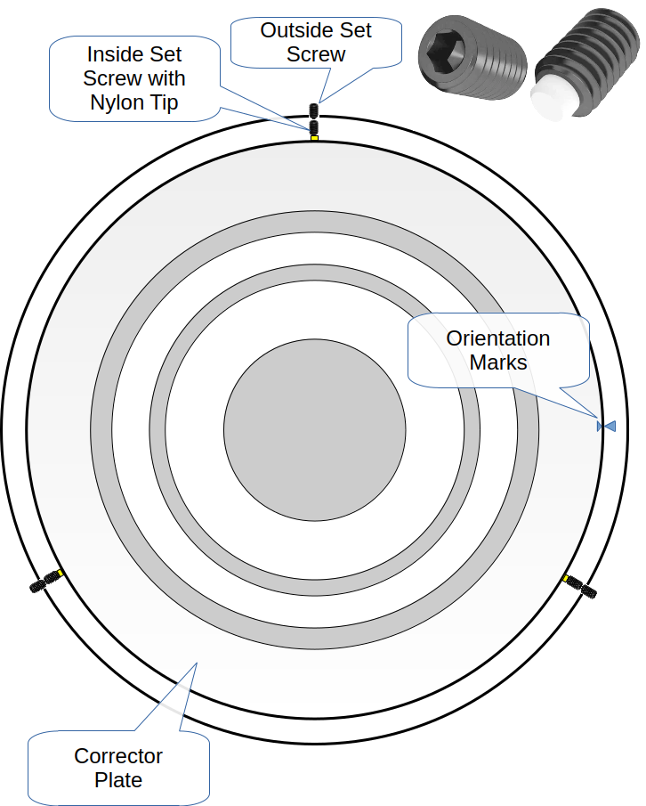
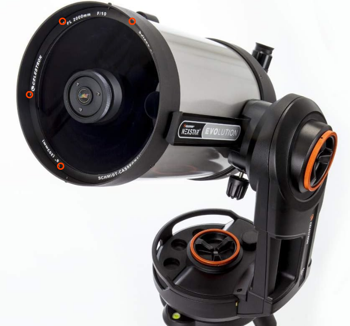

# Hyperstar-8-v4-Collimation
_Acquire Sharp Stars and a Flat Field with Hyperstar 8 v4_

Anyone owning a Hyperstar owes it to themselves to take a few minutes and review the basics and workflows recommended by its manufacturer, Starizona. Although tolerances within this optical system are measured in microns, there are elegant (and inexpensive) methods to collimate the Hyperstar. 

Many users of Starizona’s Hyperstar system manage to configure their image trains to get wonderful images. Others don’t have the same experience. This documentation is for the folks in the latter camp, who want to get into the former camp. We’ll try to stay out of the theoretical weeds in this document and stick to the concepts you need to know to achieve sharp stars and a flat field with the Hyperstar system. 

## Essentials: Free Yourself from the Fear of Collimation
"We are ready if our minds be so." - Shakespeare, _Henry V_ 

This section is about getting you cozy with how Hyperstar adjustment works and preparing the foundations for a quick collimation. 

Feeling dread? 

Collimating a Hyperstar is easier than you imagine. It is hard to mess it up beyond repair. The housing of the Hyperstar unit is two optical parts held together by three pairs of push-pull screws. That’s it. Just make sure you don't tighten _anything_ too tight.

 

You turn the screws, increasing one side of the gap between the two optical components to correct for tilt, and to perform fine collimation.

This is a handy bit here to memorize:

 

- **Tall Pull Screws** > Make fine adjustments.
- **Short Push Screws** > Lock and save your final adjustments.
- **Rotate Screws** > (not used for collimation) This are the screws with the thick, white bushing. Loosen all three rotate screws slightly to rotate your main camera. Once in place, tighten all three screws.

### The Three Pillars of Hyperstar

Three foundational conditions must exist _before_ attempting collimation. Do yourself a favor and build upon a solid, square, and level foundation.

1. [Start with a Centered Corrector Plate](#start-with-a-centered-corrector-plate). Without a centered corrector plate, fine collimation eludes you. A very confusing experience.
2. [Establish the Correct Backfocus](#check-for-correct-back-focus). Without the correct backfocus distance, stars increasingly streak (are elongated) as they get further from the center of view. 
3. [Zero Out The Hyperstar](#zero-out-the-hyperstar). Use the tool as it was designed. The "shim" method might get you good results, but at the cost of possibly moving away from ideal backfocus.

For performing the collimation itself, use [The Zero-One-Test Workflow](#the-zero-one-test-workflow). This is a simple, strategic plan for achieving good results in short order. Without a plan, you are shooting in the dark (sic).

### Use a Collimation Tool
How do you know which screws on the Hyperstar to adjust or by how much? 

You use a collimation tool to look at images (still, video, or a "live view") of a focussed star that indicate in-collimation and out-of-collimation states, and include hints of which pair of push/pull screws to adjust. All collimation tools use your main camera's sensor.

Your choice of collimation tool might include:
- Metaguide
- Tri-Bahtinov mask
- Defocused star
- NINA’s Abberration Inspector (Hocus Focus plugin)
- Sharpcap

Instructions for using any of these tools are beyond the scope of this document. We recommend Metaguide (free software), or if you prefer, a Tri-Bahtinov mask.

### The Zero-One-Test Workflow
Let's promote the collimation workflow that Starizona uses.

Begin by [Zero Out The Hyperstar](#zero-out-the-hyperstar) system, so there is no gap between the camera side and the telescope side parts of the housing. 

 

Using the guidance and clues provided by your collimation tool (Bahtinov mask, Metaguide, etc.), make adjustments to just **ONE** pair of push/pull screws - using 1/8 turn increments with the tall push screw and the neighboring short pull screw to lock in the adjustment. Practice. The following image gives you a (albeit very exaggerated) view of the effect that adjusting one pair of screws has on the relationship between the two parts: _you’re intentionally introducing tilt into the system_.

 

**TEST**.  If the adjustment results in acceptable stars in the corners of your image, then you’re done!
If your adjustment didn’t move the visual markers in your collimation tool in the right direction, you undo the adjustment you just made. In other words, you return the Hyperstar system to the zeroed-out (“no gap”) configuration. Then, you try again with a different pair of screws.
Zero, one, test, repeat if necessary.

This workflow is important. Using this method, you always stay as close as possible to the proper backfocus (assuming “no gap” is the right backfocus for you). If you make adjustments without zeroing out first, back focus incrementally drifts, which means that even with the best intentions, you get incrementally bad results.

## Start with a Centered Corrector Plate
> [!IMPORTANT]
> A corrector plate that is centered (optically “on-axis”) is the foundation for good collimation and focus with Hyperstar. Without a centered corrector plate, you don't get a flat field or sharp stars in your images. You might even think there’s something wrong with the Hyperstar itself. Stars look like old-model spacecraft from ancient aliens.

Secure the SCT on its mount and tilt it slightly upward, toward you, so that you can look straight down into the corrector. The telescope should not point horizontally or down.

Set the camera on a tripod 7 ft away, so that it points straight down into the telescope, and you can see the pattern of dark concentric rings. Look at the camera’s image and focus, zoom, or whatever is necessary to see the pattern of concentric rings.

Here’s an example of a well-centered corrector plate. Note that all circles are perfectly concentric. They are evenly spaced in all directions.

 

Here is an example of a corrector that is not centered. Take a look at the uneven spacing.

 

Make adjustments until the corrector plate appears optically “on-axis”, and all the circles are as concentric as you can get them.

_Don’t center the corrector plate relative to its enclosure._ For my corrector plate to be on-axis, it sits to one side in its enclosure.

**To center the corrector plate:**

 

1. Remove the six small screws holding the dew heater or original retaining ring. Note how “loose” these screws are. They are not tightened down. They are firm enough to hold the retaining ring in place. In the image following this instruction, four of the six screws are indicated by small red circles to give you an idea of their position.
2. If you haven’t already, make a small orientation mark on or near the outer rim of the corrector plate at the 3 o’clock position, and another mark aligned with it on the corrector plate housing. This is so that you can return to the precise orientation if the corrector plate moves one way or the other in its clockwise orientation. See the “Orientation Marks” in the previous diagram.
3. With the correct, very small hex driver, remove the three outside set screws, located exactly at 12, 4, and 8 o’clock.
4. Loosen, but don't remove the top (12 o’clock) inside set screw.
5. Adjust and center the plate with the 4 and 8 o’clock inside set screws. Make sure your orientation marks remain lined up. 
6. Once the corrector plate it is centered, gently tighten the top inside set screw to “lock” the position of the plate.
7. Insert and gently tighten all three outside set screws to “lock” the position of all three inside set screws.
8. Replace the retainer ring and reattach the three screws. Note that these do not need to be tight, but are there to secure the ring in place.
 

## Check For Correct Back Focus
Back focus for a Hyperstar system is critical. This means that the camera sensor must be a precise distance from the Hyperstar lens. Even a tiny error of 0.2mm too far or too close may be noticeable in your images. 

> [!TIP]
> [Zero Out The Hyperstar](#zero-out-the-hyperstar) before you test for back focus. Re-check collimation any time you make a change to the backfocus distance.

The following image is an example of the star pattern caused by a sensor that's too close to the Hyperstar lens. The back focus needs to be increased.

The next image is an example of the star pattern caused by a sensor that's too far from the Hyperstar lens. The back focus needs to be decreased. (Thank you to Helmut Eichler and OPT for the images!)

To ensure accurate back focus, Starizona outfits the Hyperstar v4 or the Hyperstar v4 + (new) Modular Filter Drawer with the correct camera adapter at the time of purchase. In other words, if you screwed everything together correctly, and you [Zero Out The Hyperstar](#zero-out-the-hyperstar), the backfocus should be correct. If you’re unsure that you have the right adapter for your configuration, email Starizona for confirmation.

If you need to increase the distance, you can buy M42 (T2) fine-adjustment spacers. The spacer is placed between the camera and the Hyperstar. You might need to do this if the native distance needs adjustment (very unlikely) or because you’ve added a filter (which increases backfocus by 1/3 the thickness of the filter).  Aluminum is a better material than the plastics available, and getting a set that includes a 0.3mm spacer is good. Very, very small adjustments make a big difference.

## Prepare for Collimation

**To prepare the SCT for collimation:**
1. Remove the dew shield.
2. Slew to zenith, as this allows gravity to help you with your adjustments.
3. Enable tracking. Alternatively, point to Polaris without tracking.
4. Focus. Make sure the stars in the center of view are in focus.
5. Center a bright start in the FOV.

## Zero Out the Hyperstar

**To zero out the initial configuration, i.e., start with no gap:**
1. Tighten short pull screws. 
2. Loosen long push screws. 
3. Repeat. 
4. Rotate so you can see that the gap is consistent. Repeat 1 and 2 if needed, or until the two parts of the housing sit flush against one another with no gap between them.
5. Tighten rotator screws -everything should now be tight with no play.
6. Loosely snug/tighten the long push screws.

 

## Adjust One Push/Pull Screw Pair

**To adjust one pair of screws:**
1. Loosen the short pull screw first (won't change positioning).
2. Tighten the tall push screw to increase the gap by a tiny increment. Use 1/8th turns to adjust.
3. Tighten short pull screw to lock position.
4. Recenter the bright star in the FOV after the adjustment, focus, and test the optical performance.
5. If it didn't improve, [undo the adjustment](#undo-an-adjustment) you just made, and try a different pair of screws, always recentering the bright star in the FOV after each adjustment and re-focussing, before testing optics again.
6. Repeat the previous two steps until the adjustment results in good performance.

> [!IMPORTANT]
> After you make each adjustment, you need to recenter the star in the FOV and re-focus BEFORE testing the optical performance. These steps are critical for pinpointing your ideal collimation and for making quick work of collimation.

## Undo an Adjustment

**To undo an adjustment to a pair of screws:**
1. Loosen short pull screw. 
2. Loosen tall push screw back to where it was. 
3. Tighten short pull screw.
4. You should now be "zeroed out" again, and ready to try a different pair of screws. 

## Save the Final Collimation

Once the desired optical performance is achieved, double-check that all of the short pull screws are snug. 
> [!IMPORTANT]
> Snugging down all of short pull screws after collimation is how the Hyperstar system “saves” the configuration. You can use native secondary and the Hyperstar interchangeably, and because of the stationary short pull screws, you shouldn’t need to recollimate the Hyperstar after using the native secondary.

## Re-Collimate the Hyperstar
If you need to collimate the Hyperstar again, begin by [Zero Out The Hyperstar](#zero-out-the-hyperstar) and then performing collimation.
   
# Resources

## Using Metaguide

Metaguide settings and best demos:

- https://m.youtube.com/watch?v=5NmNgtQ1SIw

- https://youtu.be/QvgtnR2VyDE

Forums:

- https://www.smallstarspot.com/
